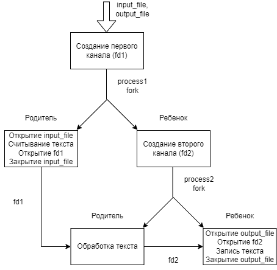

# Работа на 5
---
## Запуск
Запуск происходит через
``` gcc 5.c ```

При запуске необходимо указать имена входного и выходного файлов как аргументы командной строки. Входные файлы желательно помещать в директории /input и /output
Например:
``` input/1.txt output/1.txt ```

## Схема

