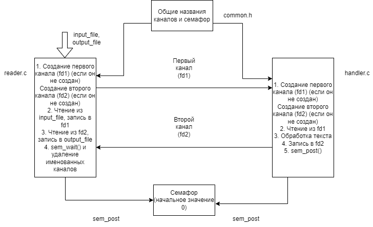

# Работа на 8
---
## Запуск
Запуск происходит через два терминала:
1) Первый
``` gcc reader.c ```
2) Второй
``` gcc handler.c ```

При запуске необходимо указать имена входного и выходного файлов как аргументы командной строки. Входные файлы желательно помещать в директории /input и /output
Например:
```./read input/1.txt output/1.txt ```
``` ./handle ```

## Схема

