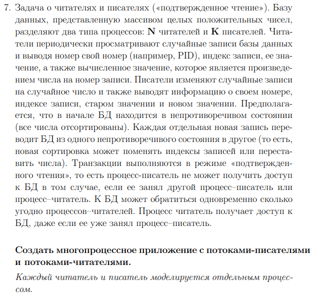
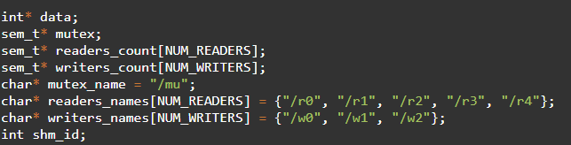

# ИДЗ №2 Максимов Никита Иванович БПИ227
---
## Варинат 7 Желаемая оценка 8

На 4-5:

Сущестувет некая библиотека data к которой обращаются и писатели и читатели.

Читатетели: При прочтении случаного элемента data выводят следующую информацию на экран. 

Писатели изменяют случайный элемент data и выводят следующую информацию на экран. 

Программа использует mutex, который ограничает доступ к data если с ней взаимодействует или писатель или читатель. Реализованны неименнованые семафоры Posix.

На 6-7:

Программа работает аналогичным образом, однако реализация семафоров изменилась на именнованные. 

На 8:

Программа работает аналогичным образом, однако использовался стандарт UNIX SYSTEM V для семафоров и разделяемой памяти. Программа разделена на два независмых файла компиляции writer.c и reader.c. 

